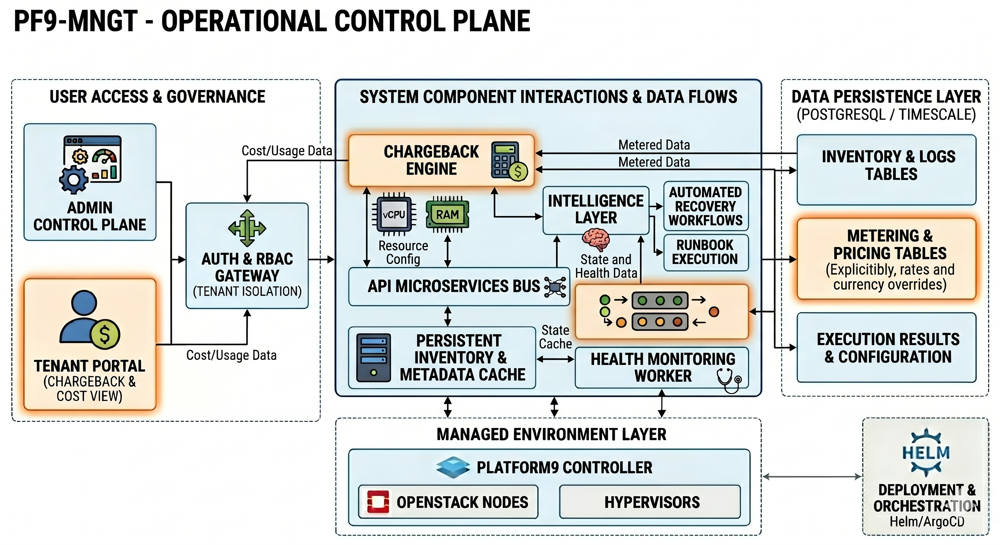

# 🚀 pf9-mngt — Engineering Operations Platform

A self-hosted operational layer designed for **engineering teams managing multi-tenant cloud environments at scale.**
Built to solve real Day-2 operational gaps in Platform9 / OpenStack environments at MSP scale.

👉 https://github.com/erezrozenbaum/pf9-mngt

---

## 📈 Project Scale

- 🏗️ 18-container microservices — designed for production deployment
- 📈 670+ commits, actively evolving — established codebase
- ✅ 583 passing tests — comprehensive test coverage (see tests/)
- 🔒 Kubernetes-native — Helm charts + ArgoCD GitOps
- 🎮 Demo mode — full product experience without Platform9

---

## 🎥 Demo

Short walkthrough showing:
- Inventory visibility  
- Snapshot automation  
- VM restore workflows  
- Migration planning 

---

## 👋 About Me

I design and build **operational platforms for real production environments**.

Focused on:
- Multi-tenant cloud operations (MSP scale)
- Day-2 automation and governance
- Migration from VMware to open platforms
- Turning operational chaos into structured systems

---

## 🎯 Who This Is For

- MSP engineering teams  
- Cloud platform teams  
- Enterprises operating Platform9 / OpenStack at scale 

---

## 💡 What This Platform Actually Solves

Built from real production gaps:

- No persistent infrastructure inventory  
- No automated restore workflows  
- No snapshot SLA visibility  
- No structured onboarding for tenants  
- No structured migration planning from VMware environments
- Limited cross-project operational visibility  

---

## 🧠 Core Capabilities

### 🌍 Multi-Cluster / Multi-Region Operations
- Single control plane across environments
- Cross-region visibility and management
- Designed for MSP-scale operations

### 📦 Inventory Intelligence
- Full infrastructure inventory (servers, volumes, networks, etc.)
- Historical tracking with change detection
- PostgreSQL-backed with JSONB + delta logic

### 🛡️ Snapshot Automation & Compliance
- Policy-driven snapshot scheduling
- Metadata-based automation (daily / monthly / retention)
- Compliance reporting per tenant / volume

### 🔁 VM Restore Orchestration
- Structured restore workflows
- Not just snapshot creation — actual recovery operations

### 🔄 Migration Planning (VMware → Platform9/OpenStack)
- RVTools-based ingestion
- Capacity planning (CPU, RAM, storage)
- Migration wave design + downtime estimation
- Target readiness validation (flavors, networks, tenants)

### 🧾 Governance, Audit & Operations
- Full audit logs
- RBAC with LDAP integration
- Change tracking across infrastructure

### 🧰 Runbooks & Ticketing
- Tier1 / Tier2 operational workflows
- Structured execution with escalation paths
- Designed for real support teams

### 📊 Metering & Reporting
- Usage visibility
- Foundation for chargeback / showback

### 🔔 Notification System
- Operational alerts and event-driven workflows

---

## ⚙️ Platform Architecture

---

## 🎯 Why This Exists

This is not a replacement for Platform9.

It is built to **extend it** with the operational capabilities engineering teams actually need in production:

- Visibility  
- Control  
- Automation  
- Governance  
- Migration readiness  

---

## 🧠 Strategic Perspective

This project reflects a broader shift:

From infrastructure management  
→ to operational systems engineering

Because at scale, infrastructure is the easy part.

---

## 🧠 Background

28+ years in IT, Engineering Manager, building and operating:

- Multi-tenant cloud environments  
- MSP platforms  
- Infrastructure automation systems  

Focused on turning **operational complexity into structured systems**.

---

## 📫 Contact

- GitHub: @erezrozenbaum
📧 Email: erez.rozenbaum@gmail.com  
📍 Location: Israel  
   
